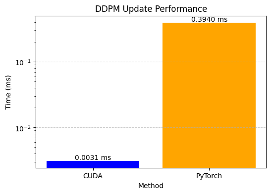

# 100 Days of GPU Programming

A daily log of my journey learning and implementing deep learning and parallel computing concepts using CUDA (NVIDIA) and HIP/RoCm (AMD).

---

## 1️⃣ Day 01

Learned how to add two 1D vectors using a basic CUDA kernel.

**Keywords and Variables:**
- `__global__`: Defines a function (kernel) that runs on the GPU, launched with `<<<...>>>`.
- `blockIdx.x`: Current block index within a grid.
- `blockDim.x`: Number of threads per block.
- `threadIdx.x`: Current thread index within the block.

**Memory Management:**
- `cudaMalloc`: Allocates memory on the GPU.
- `cudaMemcpy`: Copies memory between host (CPU) and device (GPU).
- `cudaFree`: Frees allocated GPU memory.

---

## 2️⃣ Day 02

Learned to add two 2D matrices.

**Keywords and Variables:**
- `dim3`: CUDA type for specifying 1D, 2D, or 3D dimensions for grids and blocks.
- `cudaDeviceSynchronize`: Forces CPU to wait for GPU to finish.

**Matrix Addition Formula:**
```
c[i * N + j] = a[i * N + j] + b[i * N + j]
where:
  i: row
  j: column
  N: matrix width
```
Other concepts are similar to Day 01.

---

## 3️⃣ Day 03

Learned to multiply a 2D matrix with a 1D vector.

**Example:**
```
2D matrix:
1 1 1
1 1 1
1 1 1

1D vector:
2 2 2

Result:
6 6 6
```
No new concepts today.

---

## 4️⃣ Day 04

Explored shared memory in CUDA.

**Keywords and Variables:**
- `__shared__`: Declares shared memory accessible by threads in a block.
- `__syncthreads()`: Synchronizes all threads in a block.

**Notes:**
- Static shared memory: `__shared__ int var1[10];`
- Dynamic shared memory: `extern __shared__ int var1[];`

**Partial Sum Example:**
```
sharedMemory[0] = in[0] + in[8] = 1 + 9 = 10
...
sharedMemory[7] = in[7] + in[15] = 8 + 16 = 24
```
Partial sums are then accumulated.

---

## 5️⃣ Day 05

Implemented Layer Normalization in CUDA.

**Formula:**
$$
\text{LayerNorm}(x_i) = \frac{x_i - \mu}{\sqrt{\sigma^2 + \epsilon}} \cdot \gamma + \beta
$$
Where:
- $\mu$: Mean of $x$
- $\sigma^2$: Variance of $x$
- $\epsilon$: Small constant
- $\gamma$, $\beta$: Learnable parameters

---

## 6️⃣ Day 06

Learned to transpose a matrix in CUDA.

**Keywords:**
- `cudaError_t`: CUDA error code type.
- `cudaGetLastError()`: Retrieves the last CUDA error.

---

## 7️⃣ Day 07

Learned about tiled convolution in CUDA.

**References:**
- [YouTube: Tiled Convolution](https://www.youtube.com/watch?v=ysBrzOTMZlQ)
- [Lecture PDF](https://www.cs.ucr.edu/~nael/217-f15/lectures/217-lec8.pdf)

---

## 8️⃣ Day 08

Learned the Brent-Kung algorithm for fast prefix sum.

**Reference:**
- [YouTube: Brent-Kung Prefix Sum](https://www.youtube.com/watch?v=1G4jfLcnI2w&t=88s)

---

## 9️⃣ Day 09

Implemented Flash Attention forward pass using CUDA and shared memory.

---

## 🔟 Day 10

Implemented Flash Attention for higher-dimensional tensors.

---

## 1️⃣1️⃣ Day 11

Learned about sparse matrices, ELL and COO storage formats, and their real-world importance.

---

## 1️⃣2️⃣ Day 12

Implemented parallel merge sort in CUDA.

---

## 1️⃣3️⃣ Day 13

Implemented parallel BFS and GELU activation using multiple threads.

---

## 1️⃣4️⃣ Day 14

Built a simple neural network with a linear layer.

---

## 1️⃣5️⃣ Day 15

Implemented a CNN from scratch using CUDA kernels.

---

## 1️⃣6️⃣ Day 16

Implemented FHD (Fully-Hybrid Domain) algorithm for non-cartesian MRI reconstruction in CUDA.

---

## 1️⃣7️⃣ Day 17

Learned and implemented FlashAttention-2 (forward and backward pass).

---

## 1️⃣8️⃣ Day 18

Implemented Naive Bayes with shared memory for prior and likelihood.

---

## 1️⃣9️⃣ Day 19

Used cuBLAS API for vector addition and matrix multiplication.

---

## 2️⃣0️⃣ Day 20

Explored cuDNN API for building fully connected networks and using built-in GEMM functions.

---

## 2️⃣1️⃣ Day 21

Implemented RoPE (Rotary Positional Encoding) in CUDA.

---

## 2️⃣2️⃣ Day 22

Implemented EM algorithm for 1D Gaussian vector clustering.

---

## 2️⃣3️⃣ Day 23

Implemented SwiGLU activation on 2D data.

---

## 2️⃣4️⃣ Day 24

Implemented `atomicAdd` in CUDA to count thread IDs.

---

## 2️⃣5️⃣ Day 25

Implemented Monte Carlo Tree Search in CUDA with 1024 parallel simulations.

---

## 2️⃣6️⃣ Day 26

Implemented histogram loss in parallel using shared memory.

---

## 2️⃣7️⃣ Day 27

Implemented mirror descent in CUDA with parallel threads.

---

## 2️⃣8️⃣ Day 28

Built a micrograd-like autograd engine in CUDA with parallel threads.

---

## 2️⃣9️⃣ Day 29

Learned to use CUDA Graphs for fast computation without changing kernels.

---

## 3️⃣0️⃣ Day 30

Implemented and experimented with deep learning operations and parallel computing using HIP for AMD GPUs. The project is organized into three folders:

**DL/** — Deep Learning Operations
- `conv_2d.cpp`: HIP-based 2D convolution for CNNs.
- `flash_attention_forward.cpp`: Efficient attention mechanisms.
- `gelu.cpp`: GELU activation function.
- `layer_norm.cpp`: Layer normalization kernel.
- `rope_hip.cpp`: Rotary positional encoding.

**parallel/** — Matrix Operations with Parallelism
- `matmul_rocblas.cpp`: Matrix multiplication using rocBLAS.
- `matrix_add.cpp`: Parallel matrix addition.
- `matrix_trans.cpp`: Matrix transpose with shared memory.
- `parallel_merge.cpp`: Data merging with thread-level parallelism.

**simple/** — Introductory Parallel Programs
- `partial_sum.cpp`: Basic reduction (sum).
- `prefix_sum.cpp`: Inclusive prefix sum (scan).
- `vec_reocblas.cpp`: Vector ops with rocBLAS.
- `vector_add.cpp`: Parallel vector addition.
- `vector_matrix_mul.cpp`: Vector-matrix multiplication.

---

## 3️⃣1️⃣ Day 31

Implemented Game of Life using shared memory in CUDA.

---

## 3️⃣2️⃣ Day 32

Implemented SGMM in AMD's HIP kernel.

---

## 3️⃣3️⃣ Day 33

Implemented MLP with ReLU (forward and backward).

---

## 3️⃣4️⃣ Day 34

Benchmarked CUDA vs CPU performance.

## 3️⃣5️⃣ Day 35

Ray tracing using CUDA.

---

## 3️⃣6️⃣ Day 36

Implement the Head Diffusion in HIP(AMD).

---

## 3️⃣7️⃣ Day 37

Implement the vector addition in triton.

---

## 3️⃣8️⃣ Day 38

Implement the Matrix Multiplication in triton.


## 3️⃣9️⃣ Day 39

Implement the Softmax in triton

## 4️⃣0️⃣ Day 40

Implement the fused matmul with relu.

## 4️⃣1️⃣ Day 41

Implement the Conv1d in triton.

## 4️⃣2️⃣ Day 42

Implement the Matmul using autotuing in triton.

## 4️⃣3️⃣ Day 43

Implement the leetgpu attention in cuda.

## 4️⃣4️⃣ Day 44

Implement the conv3d in cuda.

## 4️⃣5️⃣ Day 45

Implement the biods from leetGPU in cuda.

## 4️⃣6️⃣ Day 46

Implement the Muon in cuda with libtorch integration.

## 4️⃣7️⃣ Day 47

Performs multi-GPU parallel optimization using a Bee Colony metaheuristic to find the minimum of a simple sum-of-squares function.

## 4️⃣8️⃣ Day 48

Limited Mem BFGS in cuda 
- Reference: https://outoftardis.github.io/daal/daal/algorithms/optimization-solvers/solvers/lbfgs.html

## 4️⃣9️⃣ Day 49

Conjugate Gradient Method (CMG) in cuda.
- Reference: https://web.stanford.edu/class/ee364b/lectures/conj_grad_slides.pdf

## 5️⃣0️⃣ Day 50
Implement the Matmul in float16 and float8 in cuda.

## 5️⃣1️⃣ Day 51
Implement the LSTM in cuda.

## 5️⃣2️⃣ Day 52
Implement the RNN and GRU in cuda.

## 5️⃣3️⃣ Day 53
Implement the AdaHessian in cuda.

## 5️⃣4️⃣ Day 54
Implement the Bi-Directional LSTM in cuda.

## 5️⃣5️⃣ Day 55
Implement the ddpm in cuda (Failed).

## 5️⃣6️⃣ Day 56
Implement the ddpm in cuda and pytorch


## 5️⃣7️⃣ Day 57
Implement the mish Activation function in cuda.

## 5️⃣8️⃣ Day 58
Implement the Wavelet transform in triton.

## 5️⃣9️⃣ Day 59
Implement the LayerNorm in trition. :(

## 6️⃣0️⃣ Day 60
Implement the Bitonic Sort in CUDA.

## 6️⃣1️⃣ Day 61
Implement the Simulated Annealing in trion.

## 6️⃣2️⃣ Day 62 
Implement the Spectral Norm in CUDA with shared memory.

## 6️⃣3️⃣ Day 63
Implement the Group Norm in CUDA with shared memory.

## 6️⃣4️⃣ Day 64
Implement the Kl-Divergence in CUDA.

## 6️⃣5️⃣ Day 65
Implement the GeGlu in CUDA with forward and backward pass.

## 6️⃣6️⃣ Day 66
Implement the SwiGlu in CUDA with forward and backward pass.

## 6️⃣7️⃣ Day 67
Implement the Poisson Solver in CUDA.

## 6️⃣8️⃣ Day 68
Implement the Lora Linear in CUDA.

## 6️⃣9️⃣ Day 69
Implement the K means algorithm in CUDA.

## 7️⃣0️⃣ Day 70
Implement the TV distance in CUDA.

## 7️⃣1️⃣ Day 71
Implement the JSD(Jensen-Shannon Divergence) in CUDA with forward and backward passes, with loss calculation.

## 7️⃣2️⃣ Day 72
Implement the dyt the simple Derivative of the vector in CUDA.

## 7️⃣3️⃣ Day 73
Implement the mrope from qwen2vl paper in CUDA with forward and backward pass.

## 7️⃣4️⃣ Day 74
Implement the fused linear softmax in CUDA with loss caculation. 

## 7️⃣5️⃣ Day 75
Implement the Contrastive Loss in CUDA.

## 7️⃣6️⃣ Day 76
Implement the Triplet Loss in CUDA.

## 7️⃣7️⃣ Day 77
Implement the Upper Triangular Matrix Multiplication in CUDA.

## 7️⃣8️⃣ Day 78
Implement the Huber Loss in CUDA.

## 7️⃣9️⃣ Day 79
Implement the linear with swish activation in CUDA.

## 8️⃣0️⃣ Day 80
Implement the Average pool 3D in CUDA.

## 8️⃣1️⃣ Day 81
Implement the SoftPlus in CUDA.

## 8️⃣2️⃣ Day 82
Implement the Negative Cosine Similarity in CUDA. 

## 8️⃣3️⃣ Day 83
Implement the MinReduce for multi dimensional data in CUDA.

## 8️⃣4️⃣ Day 84
Implement the Tensor Matrix Multiplication in CUDA for Higher Dim.

## 8️⃣5️⃣ Day 85
Implement the Hard Sigmoid in CUDA.

## 8️⃣6️⃣ Day 86
Implement the MSE in CUDA.

## 8️⃣7️⃣ Day 87
Implement the symMatmul in CUDA.

## 8️⃣8️⃣ Day 88
Implement the Lower Triangular Matrix multiplication in CUDA.

## 8️⃣9️⃣ Day 89
Implement the hinge loss in CUDA.

## 9️⃣0️⃣ Day 90
Implement the Conv-1D in CUDA.

## 9️⃣1️⃣ Day 91
Implement the RMS norm in CUDA.

## 9️⃣2️⃣ Day 92
Implement the minimal version Transformer in CUDA.

## 9️⃣3️⃣ Day 93
Implement the 2D max Pooling in CUDA.

## 9️⃣4️⃣ Day 94
Implement the Product Over Dimension in CUDA.

## 9️⃣5️⃣ Day 95
Implement the Elu for FP16 in CUDA.

## 9️⃣6️⃣ Day 96
Implement the Leaky Relu in CUDA for float4 vector.

## 9️⃣7️⃣ Day 97
Implement the Gemm with shared memory also apply the RELU activation function on it. (CUDA)

## 9️⃣8️⃣ Day 98
Implement the Kullback Leibler Divergence in CUDA.

## 9️⃣9️⃣ Day 99
Implement the Fused Mixture of Experts (MoE) in CUDA using the cuBLAS API to accelerate inference performance.

## 1️⃣0️⃣0️⃣ Day 100
Implement a minimal version of Stable Diffusion utilizing DDPM and DDIM models to achieve a rapid forward pass.